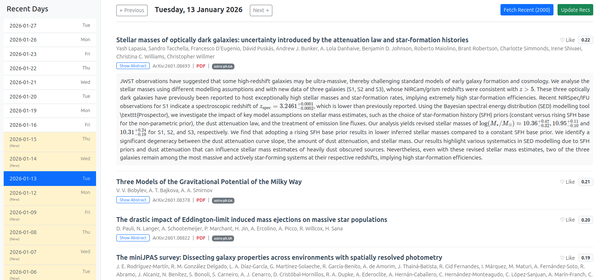

# ArXiv Local Recommender

A local web application to browse, like, and get recommendations for ArXiv papers (specifically `astro-ph`). This tool is designed as a local replacement for [benty-fields](https://benty-fields.com/).

The code was generated by the Gemini CLI agent. The prompts are provided in the LLM_prompts.md file.



## Features
*   **Local Database:** Stores papers and your interactions in a local SQLite file.
*   **ArXiv Fetcher:** Pulls the latest papers from `astro-ph`.
*   **Recommender:** Uses TF-IDF and Cosine Similarity to recommend papers based on your likes.
*   **Interface:** Clean, Benty-Fields inspired list view with MathJax support.

## Installation

1.  **Install Dependencies:**
    ```bash
    pip install -r arxiv_local/requirements.txt
    ```

## Usage

1.  **Start the Server:**
    You can use the provided script (make sure to run from this directory):
    ```bash
    ./run.sh
    ```
    Or manually:
    ```bash
    nohup python3 -m uvicorn arxiv_local.app.main:app --host 127.0.0.1 --port 8001 > server.log 2>&1 &
    ```

2.  **Open Browser:**
    Go to [http://127.0.0.1:8001](http://127.0.0.1:8001).

3.  **Fetch Papers:**
    Click the "Fetch Latest" button in the top right corner to populate the database.

4.  **Train Recommendations:**
    After liking some papers, click "Update Recs" to calculate similarity scores. Papers will then be sorted by relevance.

## Directory Structure
*   `arxiv_local/app/main.py`: Application entry point.
*   `arxiv_local/app/fetcher.py`: ArXiv API integration.
*   `arxiv_local/app/recommender.py`: Machine learning logic.
*   `arxiv_local/app/templates`: HTML templates.
*   `arxiv_local/app/database`: Database models.
